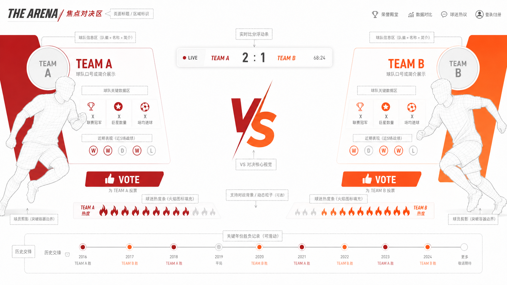
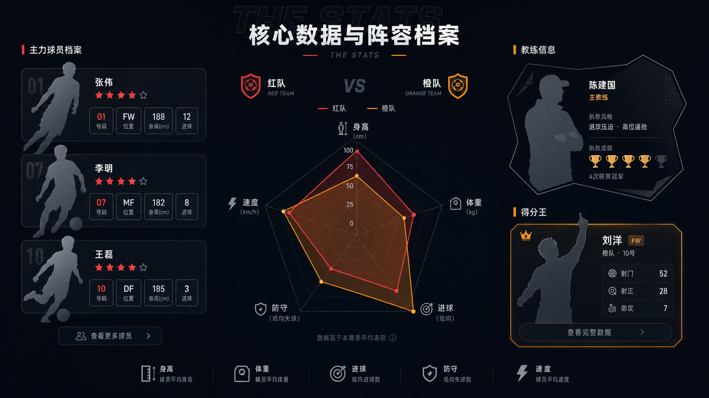
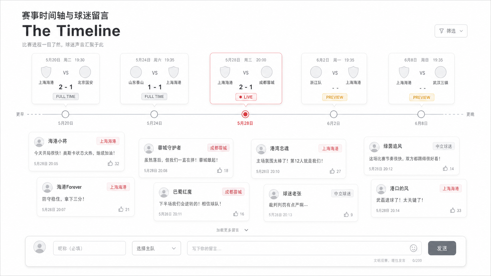

# 湘超地图互动页面重构策划方案

**文档版本**：v1.0  
**作者**：Manus AI  
**设计基调**：留白呼吸感 + 对称对比式 + 破框动感视觉  
**核心目标**：打破原有的"政务后台式"数据堆砌，采用类似"梅西 vs C罗"荣誉对比图的留白设计语言，重塑球迷互动体验。

---

## 1. 设计理念（Design Philosophy）

### 1.1 战略性留白

放弃现有的卡片平铺和网格填满策略。在核心对决区域（如焦点战、两队热度 PK），使用大面积的中轴留白。留白不仅是为了美观，更是为了让两侧的球队信息——队徽、色彩、数据——形成强烈的视觉对抗感。参考图中梅西与C罗之间的空白区域，正是这种"无声的张力"最好的体现。

> **留白 = 呼吸感，不是空白。** 它在强调"对比"这个核心主题，让用户的注意力自然聚焦在两侧的关键信息上。

### 1.2 对称与对比式布局

互动页面的核心驱动力是"竞争"。我们将球队投票、打气、战报等功能重组为"主队 vs 客队"或"我的主队 vs 竞争对手"的对比视角。左侧为球队 A（如长沙队红色系），右侧为球队 B（如株洲队橙色系），中间留白作为信息缓冲和交互触发区。这种布局天然适合足球赛事的"对决"叙事。

### 1.3 破框式元素展示

参考图中球员剪影突破了常规矩形边框，向画面中心延伸。在湘超页面中，球队的关键元素（如吉祥物、标志性球迷剪影、核心球员）将采用去底剪影，半身超出容器边界，增强画面的纵深感和动感。这种手法让页面不再是"一块块卡片的拼接"，而是一个有层次的舞台。

### 1.4 图标化数据表达

数字看板不再是干瘪的表格或大字号数字。例如，"球队热度"可以用排列的火焰图标来具象化展示；"历史荣誉"可以用堆叠的奖杯图标表示，直观且具有视觉冲击力。这种做法直接借鉴了参考图中用奖杯图标重复排列来表达数量的手法。

### 1.5 沉浸式时间轴叙事

参考图底部的金球奖时间线是串联历史的好方法。在互动页面底部或侧边，引入一条"赛季时间轴"，将实时战报、球迷留言节点、关键比赛事件串联起来，让互动具有时间维度上的故事性。

---

## 2. 页面架构重组

将原有的 `Dashboard`（数字看板）、`Interactive`（互动中心）、`Culture`（主场文化）三大割裂模块，重构为以下四个沉浸式模块，采用长卷轴式连续浏览：

| 模块 | 名称 | 对应原功能 | 核心设计语言 |
|------|------|-----------|------------|
| 模块一 | **The Arena（焦点对决区）** | 联赛榜单 + 焦点战报 + 球队热度投票 | 对称对比 + 中轴留白 + 破框剪影 |
| 模块二 | **The Stats（核心数据区）** | 球队总览 + 阵容档案 + 球员打分 | 深色背景 + 雷达图对比 + 图标化数据 |
| 模块三 | **The Culture（主场文化区）** | 城市文化锚点 + 看台组织 + 线上打气 | 文化底纹留白 + 弹幕气泡 + 横幅墙 |
| 模块四 | **The Timeline（赛事时间轴）** | 比赛评论 + 赛果速递 + 留言板 | 水平时间轴 + 瀑布流留言 + 底部输入栏 |

---

## 3. 模块一：The Arena（焦点对决区）

### 3.1 布局说明

焦点对决区占据首屏的全部视觉空间，是用户进入互动页面后看到的第一个画面。整体采用严格的左右对称布局，中间以大面积留白和一个醒目的"VS"标志作为视觉锚点。

**左侧区域（Team A）** 包含球队徽章（圆形容器）、球队名称与口号、关键数据区（联赛冠军次数、球星数量、场均进球，均以图标化方式呈现）、近 5 场战绩（以 W/D/L 圆形标记展示），以及一个醒目的红色"VOTE"投票按钮。球员剪影从左侧边缘向中间延伸，突破容器边界。

**右侧区域（Team B）** 采用完全镜像的布局，使用球队 B 的主色调（如橙色），形成视觉上的对抗。

**中间区域** 顶部悬浮一个半透明的实时比分条（LIVE 标记 + 比分 + 比赛时间），下方是大号的"VS"字样。两队的热度条从各自一侧向中间生长，以火焰图标填充，直观展示投票热度的此消彼长。

**底部** 是一条可滑动的历史交锋时间轴，标注关键年份的胜负记录。

### 3.2 交互说明

| 交互行为 | 触发方式 | 反馈效果 |
|---------|---------|---------|
| 投票 | 点击任一侧"VOTE"按钮 | 对应热度条增长一格火焰图标，按钮变为"已投票"状态，对侧按钮置灰 |
| 切换对手 | 横向滑动（Swipe）或点击球队徽章 | 整个对决区产生平滑的左右过渡动画，数据和色彩同步更新 |
| 查看战报 | 点击顶部比分条 | 展开半透明的赛况详情浮层，包含赛况摘要和关键事件 |
| 浏览历史 | 滑动底部时间轴 | 时间轴节点高亮，上方简要展示该年份的对阵结果 |

---

## 4. 模块二：The Stats（核心数据与阵容档案）

### 4.1 布局说明

核心数据区采用深色背景（#0C1118），与首屏的浅色形成强烈的视觉节奏变化，暗示用户进入了"数据深潜"区域。

**左侧** 纵向排列 3 张主力球员档案卡。每张卡片包含球员剪影（破框设计，球衣号码大字叠在剪影上）、姓名、星级评分（可交互）、以及四格迷你数据（号码、位置、身高、进球）。卡片底部有"查看更多球员"的展开入口。

**中间** 是一个大尺寸的雷达图（Radar Chart），以红色和橙色两条折线分别代表两支球队在身高、体重、进球、防守、速度五个维度的对比。雷达图上方标注两队的队徽和队名。

**右侧** 上方展示教练信息（以不规则徽章形状呈现，包含教练剪影、执教风格和执教成就），下方是"得分王"高亮卡片（金色边框，包含球员剪影、射门/射正/助攻等关键数据）。

**底部** 是一行图标化的数据图例说明（身高、体重、进球、防守、速度），帮助用户理解雷达图的各个维度。

### 4.2 交互说明

| 交互行为 | 触发方式 | 反馈效果 |
|---------|---------|---------|
| 球员打分 | 点击球员卡片上的星星 | 星星填充高亮，综合评分实时跳动更新，雷达图对应维度微调 |
| 切换球队 | 点击雷达图上方的队徽 | 雷达图折线平滑过渡到新球队的数据，左侧球员卡片同步切换 |
| 查看球员详情 | 点击球员卡片 | 卡片展开为全屏浮层，展示完整的球员档案和历史评分趋势 |
| 查看得分王 | 点击"查看完整数据"按钮 | 跳转或展开得分王的详细数据面板 |

---

## 5. 模块三：The Culture（主场文化与看台应援）

### 5.1 布局说明

主场文化区回到暖色调浅色背景（#FFFDF8），营造温暖的"归属感"氛围。整体分为左右两大区域，左侧偏信息展示，右侧偏互动体验。

**左侧（40%）** 采用大量留白和舒适的行间距，自上而下依次展示：模块标题"主场文化"（大号衬线字体）、城市文化锚点描述段落、应援团名称卡片（含图标和口号）、球迷组织卡片，以及编号列表形式的"主场仪式感"（如赛前集结、助威时刻、胜利礼仪）。

**右侧（60%）** 上半部分是一个视觉化的"打气弹幕区"——背景融入极低不透明度（12%）的城市文化建筑剪影（如传统牌楼），前景是从底部向上飘浮的彩色语音气泡（包含"加油！""必胜！""冲啊！"等文字和火焰、喇叭图标），模拟现场看台的热烈氛围。右侧下半部分展示"应援模板"按钮行（每个按钮附带热度计数）和"横幅墙"（3 张错落叠放的横幅卡片，采用球队主色调，上面印有大字书法风格的口号）。

### 5.2 交互说明

| 交互行为 | 触发方式 | 反馈效果 |
|---------|---------|---------|
| 线上打气 | 点击应援模板按钮 | 对应按钮的热度计数 +1，右侧弹幕区飘出一个新的文字气泡，伴随轻微的震动反馈 |
| 切换球队文化 | 切换顶部球队选择器 | 左侧文化信息更新，右侧背景建筑剪影切换为对应城市的文化地标 |
| 查看横幅详情 | 点击横幅卡片 | 横幅放大展示，附带横幅背后的故事说明 |

---

## 6. 模块四：The Timeline（赛事时间轴与球迷留言）

### 6.1 布局说明

赛事时间轴区采用白色背景，以一条贯穿页面中部的水平时间轴为核心视觉线索。

**上半部分** 是时间轴本体。时间轴上的每个节点对应一场比赛，以卡片形式悬浮在时间轴上方，展示比赛日期、时间、两队队徽（圆形占位）、比分和状态标签（LIVE 红色、PREVIEW 金色、FULL TIME 灰色）。当前正在进行的比赛节点以红色高亮并放大。

**下半部分** 是球迷留言的瀑布流区域。留言卡片以错落有致的方式排列（非严格网格），每张卡片包含用户头像占位、昵称、球队标签（彩色胶囊形状）、留言内容和时间戳，以及一个点赞计数。卡片之间保持充足的留白，避免信息拥挤。

**底部** 固定一个类似聊天软件的输入栏，包含头像占位、昵称输入框、球队选择下拉菜单、留言文本输入框和发送按钮。输入栏始终可见，降低用户发言的操作门槛。

### 6.2 交互说明

| 交互行为 | 触发方式 | 反馈效果 |
|---------|---------|---------|
| 浏览赛程 | 左右滑动时间轴 | 时间轴平滑滚动，节点卡片依次进入视野 |
| 查看比赛详情 | 点击时间轴上的比赛卡片 | 卡片展开为详情浮层，展示赛况摘要和关键事件 |
| 发送留言 | 填写输入栏并点击"发送" | 新留言卡片以动画形式插入瀑布流顶部，自动带上当前比赛的情境标签 |
| 筛选留言 | 点击右上角"筛选"按钮 | 展开筛选面板，可按球队、时间、热度排序 |
| 点赞留言 | 点击留言卡片上的点赞图标 | 点赞数 +1，图标变为实心 |

---

## 7. 全局交互路径优化

### 7.1 从"切换"到"滑动/对比"

现有的交互是点击 Tab 切换页面（Dashboard / Interactive / Culture），这种方式割裂了用户的浏览体验。重构后，用户通过上下滑动浏览完整的叙事线——从焦点对决的热血开场，到数据深潜的理性分析，再到文化认同的情感共鸣，最后在时间轴上留下自己的声音。整个过程是一条连贯的"观赛体验链路"。

### 7.2 所见即所得的互动反馈

现有的投票和打分反馈仅限于数字变化，缺乏情绪感染力。重构后，投票会触发微动效（如队徽放大、喷洒庆祝纸屑）；打气会触发全屏的弹幕或漂浮图标；打分会让球员卡片产生光晕效果。这些微交互虽然轻量，但能显著提升用户的"参与感"和"成就感"。

### 7.3 情境化的留言体验

不再将留言板孤立在单独的面板中。用户在看某位球员的数据时，可以直接在球员卡片旁留言；在看某场战报时，可以直接针对该场比赛评论。留言会自动带上对应的情境标签（如"长沙 vs 株洲 · 第 76 分钟"），让每条留言都有具体的上下文。

---

## 8. 设计风格对照总结

| 维度 | 现有设计 | 重构方案 |
|------|---------|---------|
| 布局 | 网格卡片平铺，Tab 切换 | 长卷轴叙事，对称对比 + 大面积留白 |
| 视觉 | 统一的政务红色调，卡片边框分割 | 明暗交替节奏（浅-深-暖-白），破框剪影增加层次 |
| 数据 | 纯文字 + 数字 | 图标化（火焰、奖杯、星星）+ 雷达图对比 |
| 互动 | 按钮点击 → 数字变化 | 按钮点击 → 微动效 + 弹幕 + 视觉反馈 |
| 留言 | 独立留言板 | 情境化留言（绑定比赛/球员上下文）|
| 导航 | 顶部 Tab 硬切换 | 纵向滑动 + 横向滑动切换对手 |
| 时间 | 无时间维度 | 赛季时间轴串联所有赛事和互动 |

---

## 9. 总结

本次重构的核心在于**"降噪"与"聚焦"**。通过大面积的留白，剔除不必要的装饰框和分割线，让球队的色彩、队徽和关键数据成为画面的绝对主角。结合对比式布局和时间轴叙事，将原本扁平的数据看板升级为一个充满情绪张力和对抗感的"线上看台"。

每一个模块都不是孤立的功能区，而是"观赛体验链路"上的一个环节。用户从焦点对决的热血开场出发，经过数据深潜的理性分析，感受主场文化的情感共鸣，最终在时间轴上留下自己的声音——这才是一个球迷互动页面应有的叙事节奏。
